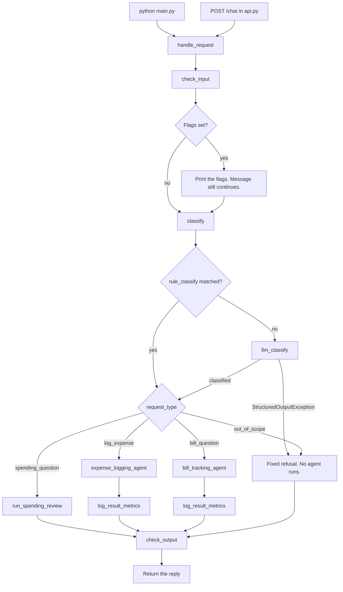
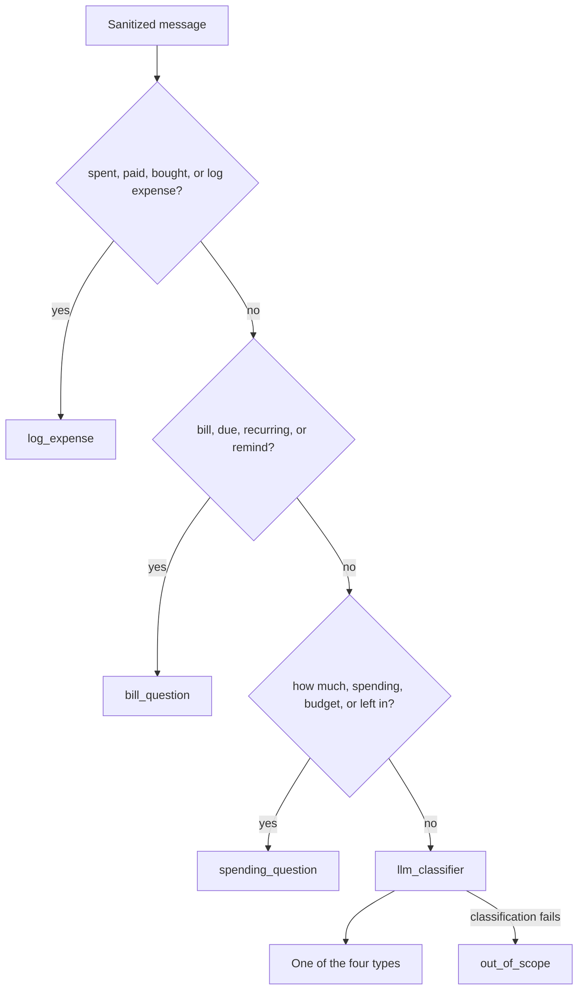
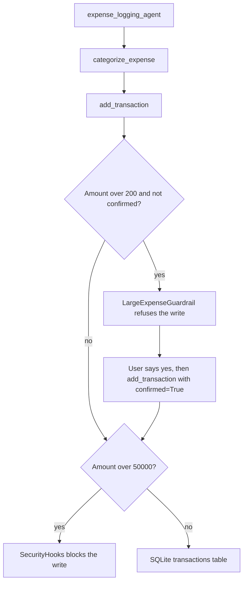
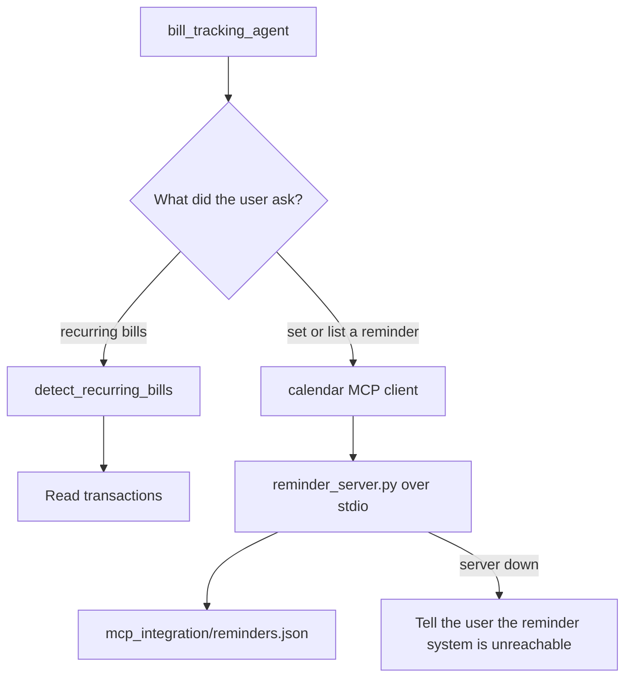
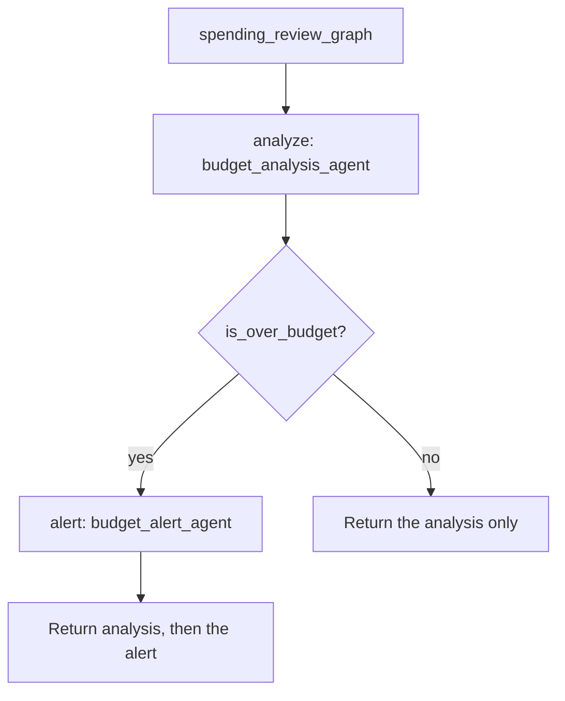

# Request flow

Every message ends up in `handle_request` in `main.py`. The CLI and the API are only two ways to get there.

`python main.py` calls `handle_request` twice, once for Dining/Coffee this month and once for Groceries this month. `api.py` sends whatever is in the JSON `message` field through the same function and returns `{"response": ...}`.

## 1. Input check

`guardrails/input_guardrails.py` does not stop the request.

- Phrases such as "ignore previous instructions" add the flag `possible_prompt_injection`.
- A 12–19 digit number is replaced with `[REDACTED]` and flagged as `possible_account_number`.
- The sanitized text is what the classifier and agents see.

## 2. Classifier

`classifier/hybrid_classifier.py` tries keyword rules first. The LLM runs only when no rule matches.

Rule order is the order in `classifier/rule_classifier.py`: logging keywords win over bill keywords, and bill keywords win over spending keywords. The LLM classifier reads `prompts/llm_classifier.txt`. If structured output fails, it returns `out_of_scope` and does not guess an agent that can write data.

## 3. Expense logging

`agents/expense_logging_agent.py` loads `prompts/expense_logging.txt`.

`categorize_expense` uses keyword lookup. If it returns `Uncategorized`, the prompt tells the agent to ask the user. The confirmation line is `CONFIRMATION_THRESHOLD` in `config/thresholds.py`. The $50,000 ceiling is `SecurityHooks.HARD_CEILING`.

## 4. Bill tracking

`agents/bill_tracking_agent.py` loads `prompts/bill_tracking.txt`.

The client is created with `continue_on_error=True`, so a dead reminder server does not crash the rest of the request.

## 5. Spending review

`run_spending_review` in `main.py` runs `orchestrator/spending_review_graph.py`.

`is_over_budget` does not read the analysis sentence. It calls `get_budget_status` for the month and categories found in the user message, using the limits in `config/settings.py`. The alert node runs only when that math says a matched category is over budget. If the message names no category, every limit in `BUDGET_LIMITS` is checked.

The analysis agent loads `prompts/budget_analysis.txt` and can call:

| Tool | Role |
| --- | --- |
| `get_today` | Real date for "this month", "today", or "last month" |
| `query_transactions` | Past spending from SQLite |
| `calculate_budget_remaining` | Remaining budget for a category and month |
| `classify_ambiguous_category` | Category specialist, `prompts/category_classifier.txt` |
| `detect_spending_trend` | Month totals computed in code, then `prompts/trend_anomaly.txt` for the wording |

It also keeps the last 10 messages in memory for that process. That window is not the SQLite database.

The alert agent loads `prompts/budget_alert.txt` and has no tools. It writes one short nudge.

## 6. Output check

`guardrails/output_guardrails.py` runs on every branch, including the refusal. If the reply matches the investment-advice patterns, the user gets a fixed spending-and-budget message instead.

Logs for invocations, tool calls, and guardrail violations go to `logs/pfa.log`. `scripts/summarize_logs.py` prints a one-line summary of that file.
